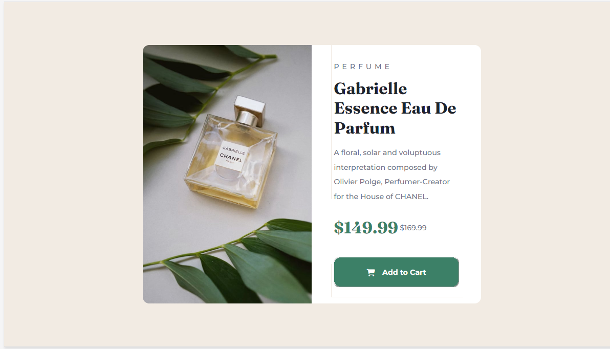

# Frontend Mentor - Product preview card component solution

## Table of contents

- [Overview](#overview)
  - [The challenge](#the-challenge)
  - [Screenshot](#screenshot)
  - [Links](#links)
- [My process](#my-process)
  - [Built with](#built-with)
  - [What I learned](#what-i-learned)
  - [Useful resources](#useful-resources)
- [Author](#author)

## Overview

This is a solution to the [Product preview card component challenge on Frontend Mentor](https://www.frontendmentor.io/challenges/product-preview-card-component-GO7UmttRfa). 

### The challenge

Users should be able to:

- View the optimal layout depending on their device's screen size
- See hover and focus states for interactive elements

### Screenshot



### Links

- Solution URL: [Add solution URL here](https://your-solution-url.com)
- Live Site URL: [Add live site URL here](https://your-live-site-url.com)

### Built with

- Semantic HTML5 markup
- CSS custom properties
- Flexbox

### What I learned
i learned how to use css flex and its properties and how to make a responsive website.
how font size is important for your site.
how to set differnt font-size according to your screen width and make it responsive.
how to use google fonts in your page.

```html
<h1>Some HTML code I'm proud of</h1>
```
```css
.proud-of-this-css {
  color: papayawhip;
}
```

### Useful resources

- [Example resource 1](https://www.w3schools.com) - This helped me to use  The Flexible Box Layout Module, makes it easier to design flexible responsive layout structure without using float or positioning. I really liked this site and will use it going forward.
- [Example resource 2](https://developer.mozilla.org/en-US/) - This is an amazing website  which helped me finally understand some flex properties , margin, font size ,positioning . I'd recommend it to anyone still learning this concept.

## Author

- Frontend Mentor - [@Subhsree](https://www.frontendmentor.io/profile/Subhsree)
